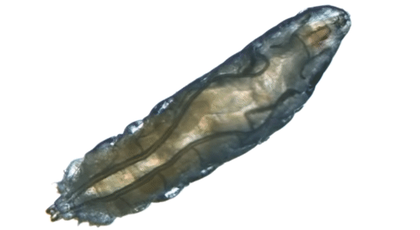
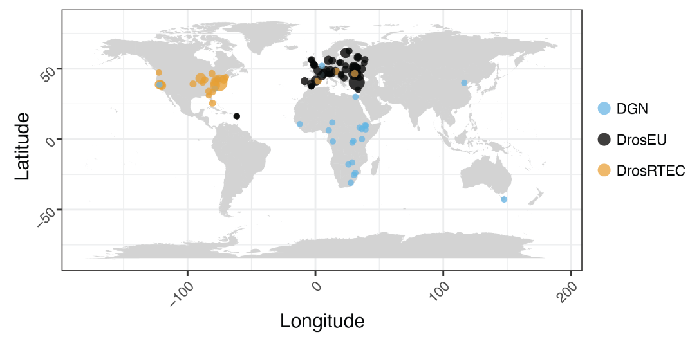

```{r, include=FALSE}
knitr::opts_chunk$set(results = 'asis',
                      echo = FALSE,
                      warning = FALSE,
                      tidy = FALSE,
                      message = FALSE,
                      fig.align = 'center',
                      dpi = 300,
                      out.width = "100%")
options(knitr.table.format = "html")

```


<style>

.main {
font-family: "Comic Sans MS";
}

body {
margin: 2cm;
}

.column {
float: right;
padding: 1cm;
}

.main p {
padding-top: 0%;
font-size: $if(main_textsize)$$main_textsize$$else$150px$endif$;
text-align: left;
}

</style>

<br>

<center>

`r colorize("**1.**", "red")` The Drosophila `r colorize("*foraging* gene", "orange")` provides an opportunity to understand the mechanisms underlying evolutionary responses to environmental variation


{width=30%}
{width=50%}

`r colorize("**2.**", "red")` Given its allelic variants, one should expect geographic variation of the `r colorize("*for* gene", "orange")` among populations

{width=60%}

`r colorize("**3.**", "red")` The DEST dataset enables one to study genetic variation accross populations spanning America and Europe

{width=102%}

</center>


